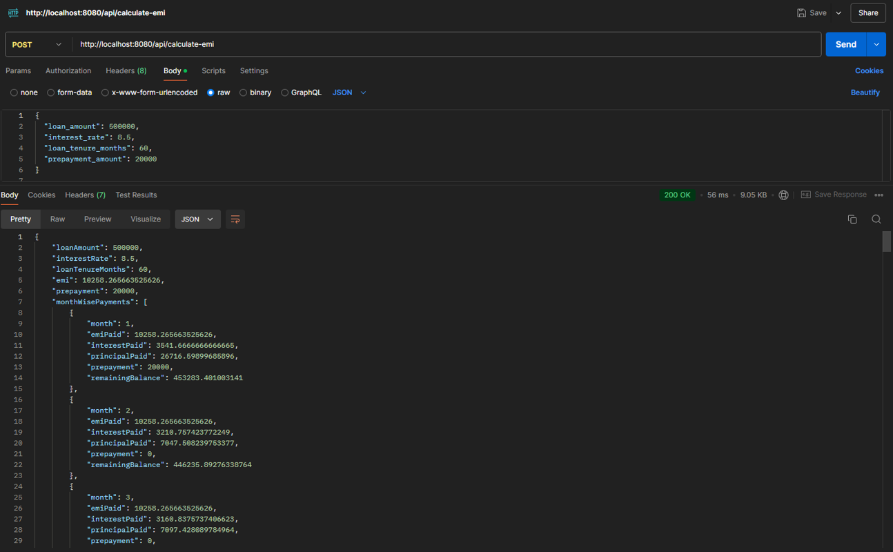
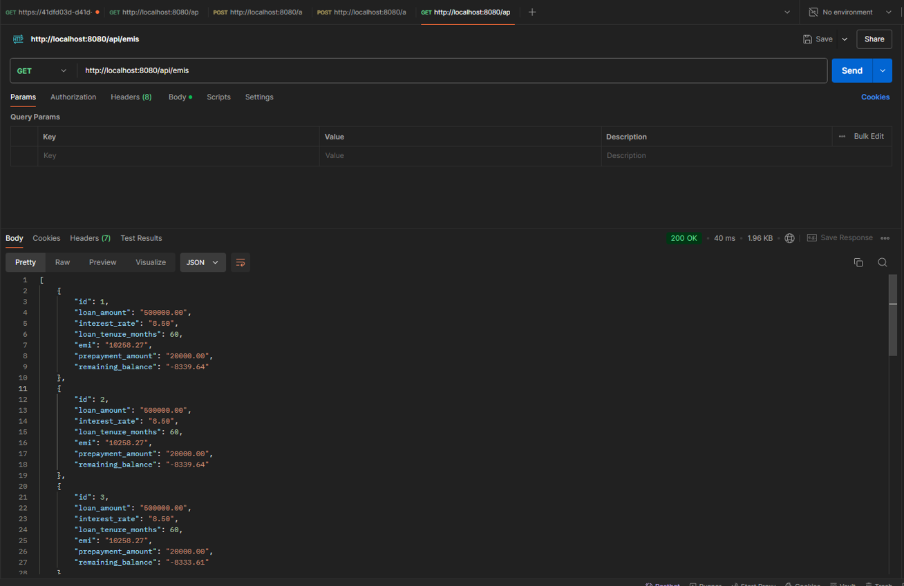
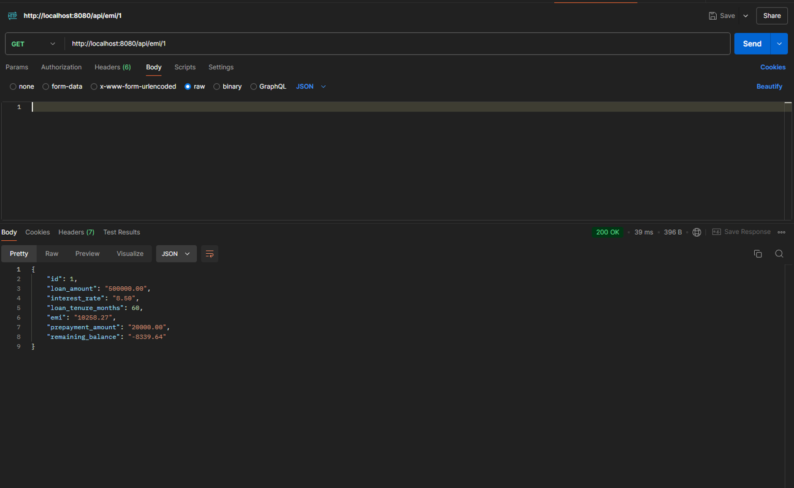

# emi-calculator

## Running the project
- clone the repo
- Install the packages using `npm install`
- setup .env file 
    - add the env value for following 
        - `DB_NAME`
        - `DB_USER `
        - `DB_PASSWORD`
        - `DB_PORT`
        - `PORT`

- to run the server use `npm start`
- (Optional) to run in dev mode use `npm run dev`

## Endpoints
- `POST /api/calculate-emi`
    - request body
    ```
        {
            "loan_amount": 500000,
            "interest_rate": 8.5,
            "loan_tenure_months": 60,
            "prepayment_amount": 20000
        }
    ```
    - response body
    ```
        {
            "loanAmount": 500000,
            "interestRate": 8.5,
            "loanTenureMonths": 60,
            "emi": 10258.265663525626,
            "prepayment": 20000,
            "monthWisePayments": [
                {
                    "month": 1,
                    "emiPaid": 10258.265663525626,
                    "interestPaid": 3541.6666666666665,
                    "principalPaid": 26716.59899685896,
                    "prepayment": 20000,
                    "remainingBalance": 453283.401003141
                },
                {
                    "month": 2,
                    "emiPaid": 10258.265663525626,
                    "interestPaid": 3210.757423772249,
                    "principalPaid": 7047.508239753377,
                    "prepayment": 0,
                    "remainingBalance": 446235.89276338764
                },
                {
                    "month": 3,
                    "emiPaid": 10258.265663525626,
                    "interestPaid": 3160.8375737406623,
                    "principalPaid": 7097.428089784964,
                    "prepayment": 0,
                    "remainingBalance": 439138.46467360266
                },
                ...
            ]
        }
    ```


- `GET /api/emis`
    - response body
    ```
    [
        {
            "id": 1,
            "loan_amount": "500000.00",
            "interest_rate": "8.50",
            "loan_tenure_months": 60,
            "emi": "10258.27",
            "prepayment_amount": "20000.00",
            "remaining_balance": "-8339.64"
        },
        ...
    ]
    ```

- `GET /api/emi/id`
    - response body
    ```
    {
        "id": 1,
        "loan_amount": "500000.00",
        "interest_rate": "8.50",
        "loan_tenure_months": 60,
        "emi": "10258.27",
        "prepayment_amount": "20000.00",
        "remaining_balance": "-8339.64"
    }
    ```
